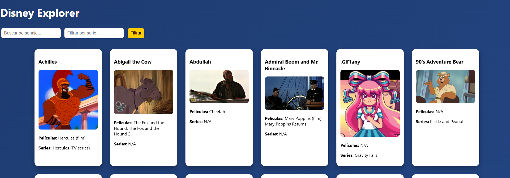
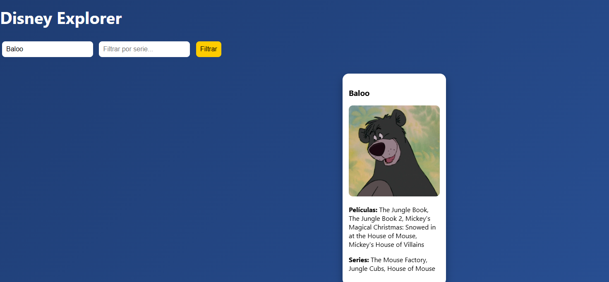
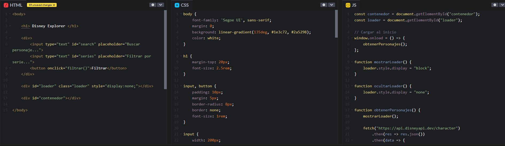
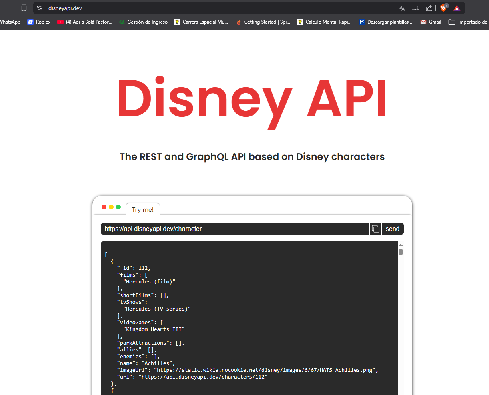

API REST DISNEY:
Aplicación Web de Personajes de Disney
Este proyecto es una página interactiva que funciona como un catálogo de Disney. Su objetivo principal es conectar con una base de datos externa para mostrar información detallada sobre cientos de personajes de forma organizada y visual.

¿Qué ofrece la aplicación?
La web se encarga de buscar la información automáticamente y presentarla en tarjetas individuales. Sus funciones principales son:

Búsqueda rápida: Puedes escribir el nombre de un personaje para encontrarlo directamente.

Filtros por serie: Permite organizar a los personajes según las series en las que aparecen.

Búsqueda avanzada: Es posible combinar varios filtros a la vez para obtener resultados más precisos.

Interfaz fluida: Incluye animaciones modernas y un indicador que avisa al usuario mientras se descargan los datos.

Tecnología utilizada
Para construir esta herramienta se usaron los pilares básicos de la web: HTML para la estructura, CSS para el diseño y las animaciones, y JavaScript, que actúa como el motor que solicita la información y la muestra en pantalla sin necesidad de recargar la página.

